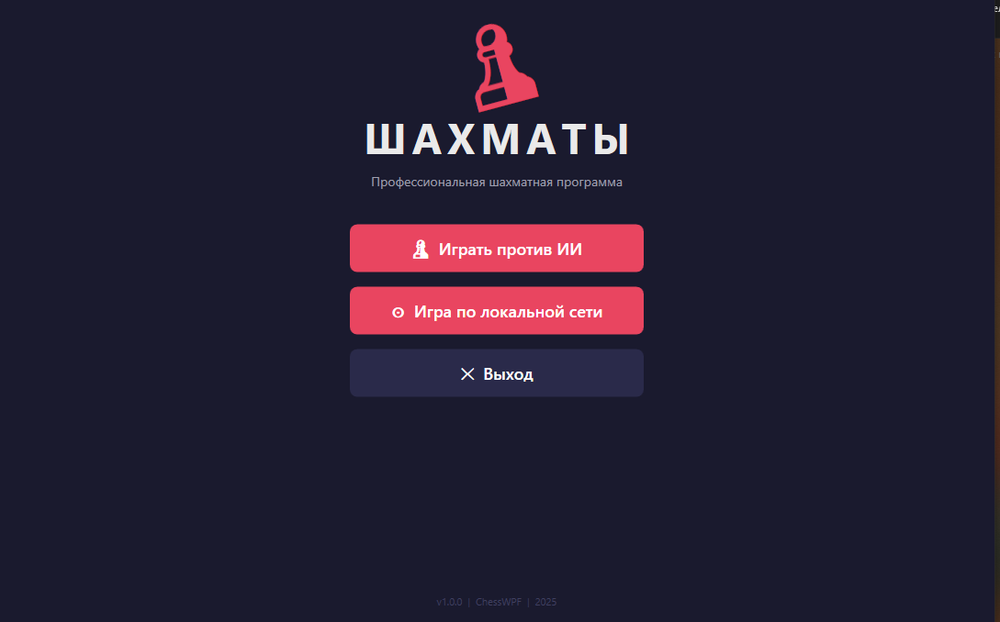

<div align="center">

# ♟️ ChessWPF

### Профессиональная шахматная программа

[](https://dotnet.microsoft.com/)
[](https://docs.microsoft.com/ru-ru/dotnet/csharp/)
[](https://docs.microsoft.com/ru-ru/dotnet/desktop/wpf/)
[](https://python.org)
[](LICENSE)

**Полнофункциональные шахматы с ИИ, сетевой игрой и русским интерфейсом**

[🎮 Скачать EXE](#-быстрый-старт) • [📖 Документация](#-архитектура) • [🐛 Сообщить об ошибке](../../issues)

---



</div>

---

## 📋 Содержание

- [О проекте](#-о-проекте)
- [Возможности](#-возможности)
- [Быстрый старт](#-быстрый-старт)
- [Игровые режимы](#-игровые-режимы)
- [ИИ противник](#-ии-противник)
- [Сетевая игра](#-сетевая-игра)
- [Архитектура](#-архитектура)
- [Правила шахмат](#-поддерживаемые-правила)
- [Лицензия](#-лицензия)

---

## 🎯 О проекте

**ChessWPF** — это профессиональная шахматная программа, написанная на **C# / WPF (.NET 8)**.
Проект создан как полноценное настольное приложение с современным тёмным интерфейсом,
умным ИИ-противником и возможностью играть по локальной сети.

> 🇷🇺 Интерфейс полностью на русском языке

---

## ✨ Возможности

<table>
<tr>
<td width="50%">

### 🎮 Игровые функции
- ♟ Полные правила шахмат
- 🤖 ИИ на алгоритме Minimax
- 🌐 Игра по локальной сети (LAN)
- 📜 История ходов партии
- 🏆 Захваченные фигуры

</td>
<td width="50%">

### 🎨 Интерфейс
- 🌑 Тёмная современная тема
- ✨ Анимация движения фигур
- 🟦 Подсветка возможных ходов
- 🟨 Подсветка последнего хода
- 🖱 Интуитивное управление мышью

</td>
</tr>
<tr>
<td>

### 🧠 Интеллект
- Minimax + Alpha-Beta отсечение
- Таблицы позиционной оценки
- Глубина поиска 3 полухода
- 🐍 Python AI движок (опционально)

</td>
<td>

### ♟ Специальные ходы
- 🏰 Рокировка (короткая и длинная)
- 👣 Взятие на проходе
- 👑 Превращение пешки
- ⚠️ Обнаружение шаха / мата / пата

</td>
</tr>
</table>

---

## 🚀 Быстрый старт

### Вариант 1 — Готовый EXE (рекомендуется)

```
1. Перейти в раздел Releases
2. Скачать ChessWPF.exe
3. Запустить — установка не нужна
```

> ✅ Работает на Windows 10 / 11 без установки .NET

---

### Вариант 2 — Сборка из исходников

#### Требования

| Компонент | Версия | Ссылка |
|-----------|--------|--------|
| Windows | 10 / 11 | — |
| Visual Studio | 2022+ | [Скачать](https://visualstudio.microsoft.com/ru/) |
| .NET SDK | 8.0+ | [Скачать](https://dotnet.microsoft.com/download) |
| Python *(опц.)* | 3.8+ | [Скачать](https://python.org) |

#### Установка

```bash
# 1. Клонировать репозиторий
git clone https://github.com/ВАШ_НИК/ChessWPF.git

# 2. Перейти в папку
cd ChessWPF

# 3. Открыть решение
start ChessWPF.sln
```

```
4. Visual Studio → F5
```

---

## 🎮 Игровые режимы

| Режим | Цвет игрока | Описание | Порт |
|-------|-------------|----------|------|
| 🤖 **Против ИИ** | ♔ Белые | Партия против компьютера | — |
| 🖥️ **Хост (ЛАН)** | ♔ Белые | Создать игру, ждать соперника | 5555 |
| 💻 **Клиент (ЛАН)** | ♚ Чёрные | Подключиться по IP-адресу | 5555 |

### Управление

| Действие | Управление |
|----------|-----------|
| Выбрать фигуру | 🖱 Левый клик по фигуре |
| Сделать ход | 🖱 Клик по синей клетке |
| Снять выделение | 🖱 Клик по пустой клетке |
| Новая игра | Кнопка «Новая игра» |
| Главное меню | Кнопка «Главное меню» |

---

## 🤖 ИИ противник

Искусственный интеллект реализован на алгоритме **Minimax с Alpha-Beta отсечением**.

```
         Позиция
        /        \
     Ход1        Ход2          ← Максимизирующий (ИИ)
    /    \      /    \
  X1     X2  X3     X4        ← Минимизирующий (игрок)
  ✂️          ✂️               ← Alpha-Beta обрезает ветки
```

### Оценка фигур

| Фигура | Символ | Очки |
|--------|--------|------|
| Пешка | ♙ | 100 |
| Конь | ♘ | 320 |
| Слон | ♗ | 330 |
| Ладья | ♖ | 500 |
| Ферзь | ♕ | 900 |
| Король | ♔ | 20 000 |

### Дополнительная оценка

Помимо материала, ИИ учитывает **позиционные таблицы** для каждой фигуры:

- 📍 Пешки стремятся к центру и продвижению
- 🐴 Кони выгоднее в центре доски
- 👁️ Слоны получают бонус за длинные диагонали
- 🏰 Ладьи на открытых вертикалях
- 👑 Король прячется в дебюте и миттельшпиле

---

## 🌐 Сетевая игра

Игра по локальной сети через **TCP сокеты** (порт **5555**).

```
┌─────────────────────┐         ┌─────────────────────┐
│   ХОСТ (Белые)      │         │   КЛИЕНТ (Чёрные)   │
│                     │         │                     │
│ 1. Нажать "Хост"    │◄───────►│ 1. Нажать "Клиент"  │
│ 2. Сообщить IP      │  TCP    │ 2. Ввести IP хоста  │
│ 3. Ждать соперника  │ :5555   │ 3. Подключиться     │
│ 4. Играть белыми    │         │ 4. Играть чёрными   │
└─────────────────────┘         └─────────────────────┘
```

> 💡 Узнать свой IP: `Пуск → cmd → ipconfig → IPv4`

---

## 🏗 Архитектура

```
ChessWPF/
│
├── 📁 Views/                   # Представления (UI)
│   ├── MainMenuView.xaml       # Главное меню
│   ├── GameView.xaml           # Игровой экран
│   ├── PromotionDialog.xaml    # Превращение пешки
│   ├── GameOverDialog.xaml     # Конец игры
│   └── LanSetupDialog.xaml     # Настройка сети
│
├── 📁 Models/                  # Модели данных
│   ├── Board.cs                # Шахматная доска 8×8
│   ├── Piece.cs                # Фигура (тип, цвет, флаги)
│   ├── Move.cs                 # Ход (откуда, куда, флаги)
│   ├── PieceType.cs            # Перечисление типов фигур
│   └── PieceColor.cs           # Перечисление цветов
│
├── 📁 GameLogic/               # Игровая логика
│   ├── GameManager.cs          # Управление состоянием игры
│   ├── MoveGenerator.cs        # Генерация псевдо-легальных ходов
│   └── MoveValidator.cs        # Фильтрация нелегальных ходов
│
├── 📁 AI/                      # Искусственный интеллект
│   └── AIManager.cs            # Minimax + Alpha-Beta + PST
│
├── 📁 Network/                 # Сетевая игра
│   ├── LANServer.cs            # TCP сервер (хост)
│   └── LANClient.cs            # TCP клиент
│
├── 📁 UI/                      # UI утилиты
│   ├── PieceImages.cs          # Unicode символы фигур
│   └── BoardRenderer.cs        # Геометрия доски
│
└── 📁 PythonAI/                # Python движок (опционально)
    └── chess_engine.py         # Minimax на Python + TCP сервер
```

---

## ♟ Поддерживаемые правила

| Правило | Статус | Описание |
|---------|--------|----------|
| Начальная позиция | ✅ | Стандартная расстановка фигур |
| Ход пешки | ✅ | Вперёд на 1, с начала на 2 |
| Взятие пешкой | ✅ | По диагонали |
| Взятие на проходе | ✅ | En passant |
| Превращение пешки | ✅ | Ферзь / Ладья / Слон / Конь |
| Ход коня | ✅ | Г-образный прыжок |
| Ход слона | ✅ | По диагонали |
| Ход ладьи | ✅ | По горизонтали и вертикали |
| Ход ферзя | ✅ | Ладья + Слон |
| Ход короля | ✅ | На одну клетку |
| Рокировка | ✅ | Короткая и длинная |
| Запрет хода под шах | ✅ | Полная валидация |
| Обнаружение шаха | ✅ | С уведомлением |
| Обнаружение мата | ✅ | Конец игры |
| Обнаружение пата | ✅ | Ничья |

---

## 🐍 Python AI (опционально)

```bash
cd PythonAI
python chess_engine.py
```

| Параметр | Значение |
|----------|----------|
| Протокол | TCP Socket |
| Порт | 6000 |
| Входные данные | FEN-строка |
| Выходные данные | Ход в UCI формате |
| Алгоритм | Minimax + Alpha-Beta |
| Глубина | 3 |

---

## 📊 Стек технологий

| Технология | Назначение | Версия |
|-----------|-----------|--------|
| C# | Основной язык | 12.0 |
| WPF | Графический интерфейс | .NET 8 |
| XAML | Разметка UI | — |
| TCP Sockets | Сетевая игра | — |
| Python | Дополнительный AI | 3.8+ |

---

## 📄 Лицензия

```
MIT License

Copyright (c) 2025 ChessWPF

Разрешается свободно использовать, копировать, изменять
и распространять данное программное обеспечение.
```

---

<div align="center">

**Сделано с ❤️ на C# / WPF**

⭐ Поставьте звезду если проект понравился!

</div>
